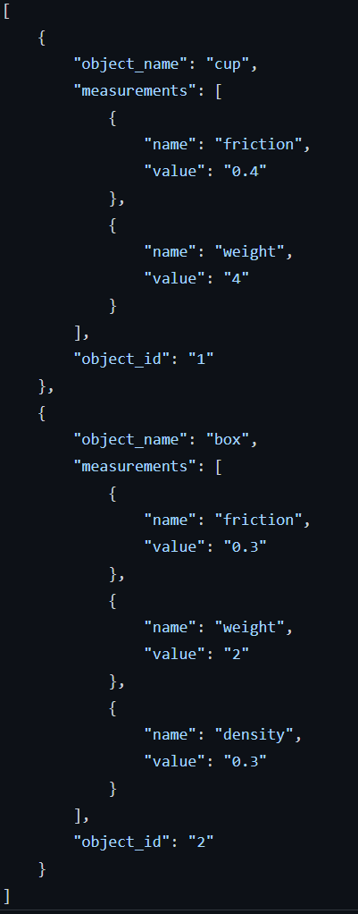

# IPALM Dataset

This repository provides a framework to generate an object dataset with physical properties and their relation as shown in figure below. The dataset then can be used for different purposes such as: grasp sampling, exploration action selection, etc. 


The framework includes two main components:
* Model component (`model.py`) where we define the type of physical properties and their relation. Example is shown in figure below with "density - mass relationship":


* Measurement component (`measurement.py`) where we all the actual measurement/data of the object. Example is shown in figure below with two objects: 


# Usage
## Use for model.py
```
from model import Model
model = Model("./model.json")
```

Add properties: (name, type)

``model.add_prop("mass","continuous")``

Add relations: (parent, child, type, parameters)

``model.add_relation("density","linear-gaussian","linear-gaussian","[A:1 B:2 Sigma:3]")``


## Use for measurements.py (Store real measurements for each object)
```
from measurements import ObjectMeasurements
object1 = ObjectMeasurements("./meas.json","1","cup") #The 1st argument is that path to the json output file, 2nd is the object_id
object2 = ObjectMeasurements("./meas.json","2","box") #The 1st argument is that path to the json output file
```
Create a new object and add properties + value: (name, value) 

```
object1.add_meas("friction","0.4")
object1.add_meas("weight","4") #All measurements need to be added before updating the json
object1.update() #Update the json file
object2.add_meas("friction","0.9")
object2.add_meas("weight","2") #All measurements need to be added before updating the json
object2.update() #Update the json file
```

If you later want to update the existing object with new measurement:
```
object1.modify("friction","0.8") #Edit the value of the object
object1.modify("density","2.3") #Add new prop to object
```

